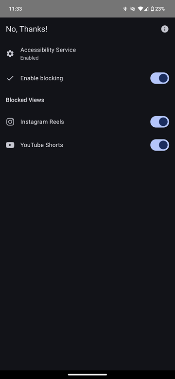
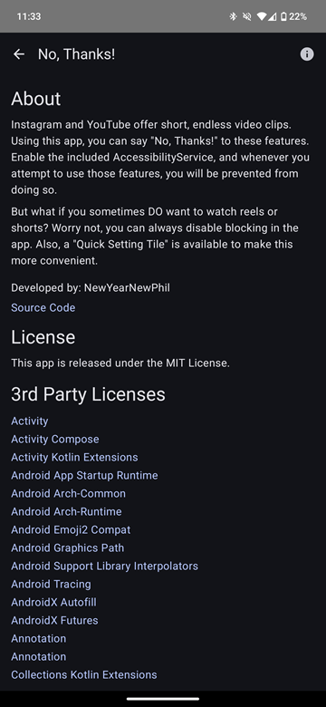
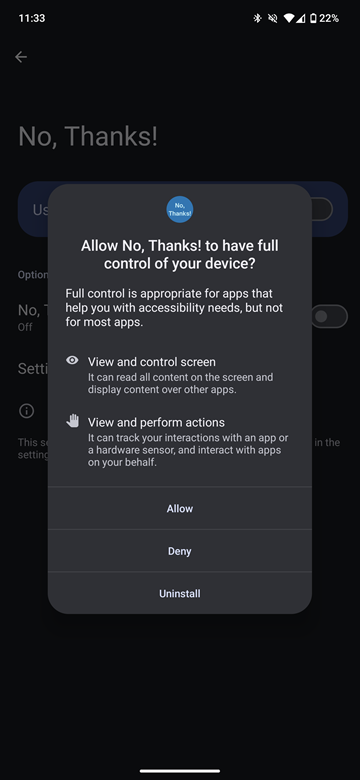

# No, Thanks! - Block Instagram Reels and YouTube Shorts
Instagram and YouTube offer short, endless video clips. Using this app, you can say "No, Thanks!" to these features. Enable the included AccessibilityService, and whenever you attempt to use those features, you will be prevented from doing so.
But what if you sometimes DO want to watch reels or shorts? Worry not, you can always disable blocking in the app. Also, a "Quick Setting Tile" is available to make this more convenient.

⚠️ App must be enabled as "Accessibility Service" in Android Settings to work!

⚠️ Sometimes this setting might be "restricted" for apps not installed trough an App Store, in that case you can "unrestrict" it by opening App Info > Three Dots > "Enable Restricted Settings".

I also wrote an accompanying [blog post](https://nynp.dev/logs/no-thanks-app/)!

## Screenshots

# Contributing etc.
Primarily made this for myself, kind of hacked it together in a few hours. There's an app in the Play Store that already [does this](https://play.google.com/store/apps/details?id=com.newswarajya.noswipe.reelshortblocker), but I dont like it. This is a primitive FOSS version, basically.
You can grab the .apk from the releases (or build from source of course). If there's any interest, I'm open to publishing the app on F-Droid, and I'm of course also open to feature requests, pull requests, all that.